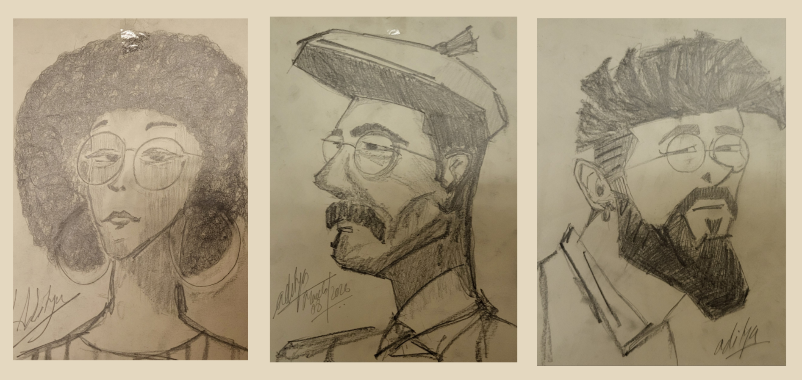

"*I learned very early the difference between knowing the name of something and knowing something.*”

                                                                         ... Richard P. Feynman

  
&nbsp;&nbsp;Believing in R.F.’s words, I joined Weizmann as a graduate student to train myself as a Computational Chemist, and since then, I have worked with a wide range of software and research challenges.  

&nbsp;&nbsp;Somewhere between quantum mechanics and chemistry, I deal with the time-independent Schrödinger equation, simulate molecular dynamics, and study reaction kinetics—trying to bring some order to the chaos of the quantum world. For this purpose, I joined the group of Prof. Gershom (Jan M. L.) Martin at the Department of Molecular Chemistry and Materials Science last year.  

&nbsp;&nbsp;Previously, during my M.Sc., with the help of my lab seniors, I developed a strong mindset to persist and stay focused on the same problem despite repeated failures. As a challenging profession, research has helped me learn to work in a team, think about problems from new perspectives, and approach them systematically. With these capabilities, I aim to explore the vast quantum world further and deepen my understanding in this exciting field of theoretical chemistry.  

&nbsp;So, I am Aditya— a quantum and programming enthusiast— and thank you for visiting my website. A brief overview of my education, research work, life, and hobbies is given below:  

## Education
- **2025-Present:** &nbsp;&nbsp; Ph.D. in Computational Quantum Chemistry, Department of Molecular Chemistry and Materials Science, Weizmann Institute of Science, Israel  
- **2021-2023:** &nbsp;&nbsp; M.Sc. in Chemistry, Department of Chemistry, Malaviya National Institute of Technology, Jaipur, Rajasthan, India   
- **2018-2021:** &nbsp;&nbsp; B.Sc. in Chemistry (Hons.), Department of Chemistry, Ramakrishna Mission Vivekananda Centenery College, Rahara, Kolkata, India   

## Research Experiences
- **May, 2025-Present:** &nbsp;&nbsp; Ph.D. Thesis, Weizmann Institute of Science, Israel\
Supervisor: Prof. Gershom (Jan M. L.) Martin\
Thesis title: Next-Generation Accurate Wavefunction-based Thermochemistry: W5 Theory and Approximations Through Localized-Orbital Coupled Cluster Approaches and Δ Machine Learning.  

- **Oct., 2024-March, 2025:** &nbsp;&nbsp; Project Associate, Malaviya National Institute of Technology, Jaipur, Rajasthan, India\
PI: Dr. Pradeep Kumar\
Project Title: Computational modelling of Heterogeneous and Multiphase Chemistry in the Atmosphere.  

- **June, 2023-Oct., 2023:** &nbsp;&nbsp; Extension of Master’s Thesis, Malaviya National Institute of Technology, Jaipur, Rajasthan, India\
Supervisor: Dr. Pradeep Kumar\
Thesis title: Stereodynamic origin of mode selectivity in the NH3 + F →  NH2 + HF reaction.  

- **April, 2022-May, 2023:** &nbsp;&nbsp; Master’s Thesis, Malaviya National Institute of Technology, Jaipur, Rajasthan, India\
Supervisor: Dr. Pradeep Kumar\
Thesis title: Origin of mode selectivity (Umbrella inversion mode) in the reaction NH3 + F → NH2 + HF?  

## Computational Chemistry Codes
- **FORT (Fortran Operator for Rate Theory):** A generalized FORTRAN code (with LAPACK routines) that evaluates partition functions for reaction
species and applies them to compute Conventional Transition State Theory (CTST) rate constant. [Link](https://github.com/atomicadi/Chemical-kinetics_in-Fortran/tree/main/FORT_CTST)

- **Microcanonical normal-mode sampling** is implemented in Fortran to generate initial conditions at fixed total energy (NVE) for molecular dynamics/trajectory simulations. [Link](https://github.com/atomicadi/Microcanonical-normal-mode-sampling_in-Fortran)

- **Fortran 1D Fourier Grid Hamiltonian (FGH)** solver to compute bound- state spectra for the Morse potential of H2, and the double-well potential of NH3. [Link](https://github.com/atomicadi/Fourier-Grid-Hamiltonian_in-Fortran) 

## Publications
- **2026**

(3) Fishman, V.; Lőrincz, B. D.; Semidalas, E.; **Barman, A.**; Martin, J. M. L.; Nagy, P. R.; Kállay, M. Development of Local Natural Orbital Arbitrary Order Coupled Cluster Methods and Assessment through Connected Quadruples. _J. Phys. Chem. A_, **2026**, xxx, xx, xxxx-xxxx (will beupdated soon). [Link](https://doi.org/10.1021/acs.jpca.6c00607) 

(2) **Barman, A.**; Jones, G. H.; Weflen, K. E.; Shepelenko, M.; Martin, J. M. L. Coupling between Thermochemical Contributions of Subvalence Correlation and of Higher-Order Post-CCSD(T) Correlation Effects — A Step toward “W5 Theory”.  _J. Phys. Chem. A_, **2026**, 130, 2943-2955. [Link](https://doi.org/10.1021/acs.jpca.6c00467) 

- **2024**

(1) **Barman, A.**; Kumar, A.; Kumar, P. Stereodynamic origin of mode selectivity in the NH3 + F → NH2 + HF reaction.  _J. Chem. Sci._, **2024**, 136, 64. [Link](https://doi.org/10.1007/s12039-024-02306-1) 

## Hobbies

  
  &nbsp;&nbsp; During the 2026 Iran–U.S. conflict, I revisited my (pseudo!) art hobby at the Leonardo Hotel lobby in Jerusalem, Israel.

  
  &nbsp;&nbsp; During the 2026 Iran–U.S. conflict, I revisited my (pseudo!) art hobby at the Leonardo Hotel lobby in Jerusalem, Israel.

## Contact Info
Aditya Barman, Graduate Student,\
Room 262, Kimmelman Building, Weizmann Institute of Science, 234 Herzl St., Rehovot 7610001, Israel\
Email Id: aditya.barman@weizmann.ac.il (Institutional), atomicadi2023@gmail.com (Personal)\
[Google Scholar](https://scholar.google.com/citations?user=Zo7VTdgAAAAJ&hl=en), [ResearchGate](https://www.researchgate.net/profile/Aditya-Barman-3), [ORCID](https://orcid.org/0009-0003-3863-2564)

