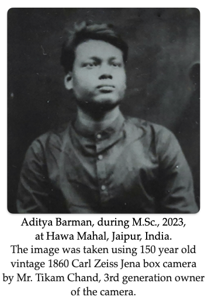

"*I learned very early the difference between knowing the name of something and knowing something.*”

                                                                         ... Richard P. Feynman

  
&nbsp;&nbsp;Believing in R.F.’s words, I joined Weizmann as a graduate student to train myself as a Computational Chemist, and since then, I have worked with a wide range of software and research challenges.  

&nbsp;&nbsp;Somewhere between quantum mechanics and chemistry, I deal with the time-independent Schrödinger equation, simulate molecular dynamics, and study reaction kinetics—trying to bring some order to the chaos of the quantum world. For this purpose, I joined the group of Prof. Gershom (Jan M. L.) Martin at the Department of Molecular Chemistry and Materials Science last year.  

&nbsp;&nbsp;Previously, during my M.Sc., with the help of my lab seniors, I developed a strong mindset to persist and stay focused on the same problem despite repeated failures. As a challenging profession, research has helped me learn to work in a team, think about problems from new perspectives, and approach them systematically. With these capabilities, I aim to explore the vast quantum world further and deepen my understanding in this exciting field of theoretical chemistry.  

&nbsp;Thank you for visiting my website. A brief overview of my education, research work, life, and hobbies is given below:  

## Education
2025-Present: &nbsp;&nbsp; Ph.D. in Computational Quantum Chemistry, Department of Molecular Chemistry and Materials Science, Weizmann Institute of Science, Israel  
2021-2023: &nbsp;&nbsp; M.Sc in Chemistry, Department of Chemistry, Malaviya National Institute of Technology, Jaipur, India   
2018-2021: &nbsp;&nbsp; B.Sc in Chemistry (Hons.), Department of Chemistry, Ramakrishna Mission Vivekananda Centenery College, Rahara, Kolkata, India   

## Research Experiences
**2025-Present:** &nbsp;&nbsp; Ph.D. Thesis, Weizmann Institute of Science, Israel
Supervisor: Prof. Gershom (Jan M. L.) Martin\
Thesis title: Next-Generation Accurate Wavefunction-based Thermochemistry: W5 Theory and Approximations Through Localized-Orbital Coupled Cluster Approaches and Δ Machine Learning  

**2021-2023:** &nbsp;&nbsp; M.Sc Thesis, Malaviya National Institute of Technology, Jaipur, India  
Supervisor: Dr. Pradeep Kumar\
Thesis title: Origin of mode selectivity (Umbrella inversion mode) in the reaction NH$_3$ + F → NH$_2$ + HF?  

2018-2021: &nbsp;&nbsp; B.Sc in Chemistry (Hons.), Department of Chemistry, Ramakrishna Mission Vivekananda Centenery College, Rahara, Kolkata, India   
